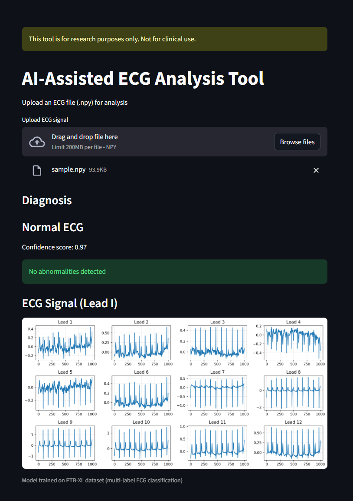

# 🫀 CardioScan — AI ECG Analysis Platform

A full-stack web application for 12-lead ECG multi-label cardiac classification,
built on top of the PTB-XL notebook. Uses a deep 1D-ResNet trained to detect
5 diagnostic superclasses.

---

## Architecture

```
ecg-app/
├── backend/                  # FastAPI Python API
│   ├── app/
│   │   ├── main.py           # App entry point + CORS
│   │   ├── database.py       # Async SQLite setup
│   │   ├── dependencies.py   # JWT auth dependency
│   │   ├── models/
│   │   │   └── ecg_model.py  # ECGNet + ResidualBlock (PyTorch)
│   │   ├── services/
│   │   │   ├── model_service.py  # Singleton inference engine
│   │   │   └── auth_service.py   # bcrypt + JWT helpers
│   │   ├── schemas/
│   │   │   └── schemas.py    # Pydantic request/response models
│   │   ├── routes/
│   │   │   ├── auth.py       # POST /api/auth/register|login
│   │   │   ├── predict.py    # POST /api/predict/
│   │   │   ├── history.py    # GET|DELETE /api/history/
│   │   │   └── stats.py      # GET /api/stats/
│   │   └── model/
│   │       └── ecg_full_model.pth   ← place your checkpoint here
│   ├── requirements.txt
│   └── Dockerfile
│
├── frontend/                 # React + Vite + TailwindCSS
│   ├── src/
│   │   ├── App.jsx           # Router setup
│   │   ├── main.jsx          # Entry point
│   │   ├── index.css         # Global styles + Tailwind
│   │   ├── utils/api.js      # Axios client + all API calls
│   │   ├── hooks/useAuth.jsx  # Auth context
│   │   ├── components/
│   │   │   ├── Layout.jsx    # Sidebar + outlet
│   │   │   └── ResultCard.jsx # Prediction result display
│   │   └── pages/
│   │       ├── HomePage.jsx   # Landing page
│   │       ├── LoginPage.jsx
│   │       ├── RegisterPage.jsx
│   │       ├── PredictPage.jsx  # Main analysis form
│   │       ├── DashboardPage.jsx # Charts + model metrics
│   │       └── HistoryPage.jsx  # Prediction history table
│   ├── package.json
│   ├── vite.config.js
│   └── tailwind.config.js
│
└── docker-compose.yml
```

---

<<<<<<< HEAD
## Model Details

| Property         | Value                                    |
|-----------------|------------------------------------------|
| Dataset          | PTB-XL (21,799 records)                  |
| Input            | 12-lead ECG, 1000 timesteps @ 100 Hz     |
| Architecture     | 3× 1D ResidualBlock (12→64→128→256)      |
| Classifier       | Linear(256,128) → ReLU → Dropout → Linear(128,5) |
| Loss             | Focal Loss + pos_weight for imbalance    |
| Sampler          | WeightedRandomSampler                    |
| Epochs           | 10                                       |
| Macro AUC        | **0.917**                                |
| NORM AUC         | 0.938 · MI AUC: 0.927 · CD AUC: 0.897  |

### Classes

| Code  | Full Name                  | Threshold |
|-------|----------------------------|-----------|
| NORM  | Normal ECG                 | 0.55      |
| MI    | Myocardial Infarction      | 0.45      |
| CD    | Conduction Disturbance     | 0.70      |
| HYP   | Hypertrophy                | 0.65      |
| STTC  | ST/T-Change                | 0.65      |

---

## Quick Start (Local)

### 1. Backend

```bash
cd backend

# Create virtual environment
python -m venv venv
source venv/bin/activate        # Windows: venv\Scripts\activate

# Install dependencies
pip install -r requirements.txt

# Copy your trained model checkpoint
cp /path/to/ecg_full_model.pth app/model/ecg_full_model.pth

# Run API (auto-reloads on changes)
uvicorn app.main:app --reload --port 8000
```

The API will be available at **http://localhost:8000**
Interactive docs at **http://localhost:8000/docs**

> **No model checkpoint?** The API runs in demo mode with random weights — all endpoints work but predictions are random.

### 2. Frontend

```bash
cd frontend

# Install packages
npm install

# Start dev server
npm run dev
```

The app will be at **http://localhost:5173**

---

## Docker Compose (Recommended)

```bash
# From project root
cp your_model.pth backend/app/model/ecg_full_model.pth

docker-compose up --build
```

- Frontend: http://localhost:5173
- Backend:  http://localhost:8000

---

## API Reference

### Authentication

```bash
# Register
curl -X POST http://localhost:8000/api/auth/register \
  -H "Content-Type: application/json" \
  -d '{"username":"demo","email":"demo@example.com","password":"secret123"}'

# Login
curl -X POST http://localhost:8000/api/auth/login \
  -H "Content-Type: application/json" \
  -d '{"username":"demo","password":"secret123"}'
```

### Prediction

```bash
# Generate a test signal (Python)
python3 -c "
import numpy as np, json
sig = np.random.randn(1000, 12).tolist()
print(json.dumps({'signal_data': sig, 'patient_name': 'Test Patient', 'age': 55, 'sex': 'M'}))
" > test_payload.json

# Run prediction (no auth required for basic prediction)
curl -X POST http://localhost:8000/api/predict/ \
  -H "Content-Type: application/json" \
  -H "Authorization: Bearer YOUR_TOKEN" \
  -d @test_payload.json
```

**Response:**
```json
{
  "id": 1,
  "predictions": [
    {"class": "NORM", "description": "Normal ECG",            "probability": 0.92, "positive": true},
    {"class": "MI",   "description": "Myocardial Infarction", "probability": 0.08, "positive": false},
    ...
  ],
  "top_class": "NORM",
  "confidence": 0.92,
  "positive_classes": ["NORM"],
  "patient_name": "Test Patient",
  "age": 55,
  "sex": "M"
}
```

### History & Stats (require auth)

```bash
TOKEN="your_jwt_token"

# Get history
curl http://localhost:8000/api/history/ -H "Authorization: Bearer $TOKEN"

# Get stats
curl http://localhost:8000/api/stats/ -H "Authorization: Bearer $TOKEN"

# Delete a record
curl -X DELETE http://localhost:8000/api/history/1 -H "Authorization: Bearer $TOKEN"
```

---

## Exporting Your Signal for the API

From the notebook / Python:

```python
import numpy as np, json

# X_test[0] has shape (1000, 12)
signal = X_test[0]   # numpy array

# Method 1: save as JSON for the frontend file uploader
with open("sample_signal.json", "w") as f:
    json.dump(signal.tolist(), f)

# Method 2: POST directly from Python
import requests
r = requests.post(
    "http://localhost:8000/api/predict/",
    json={"signal_data": signal.tolist(), "patient_name": "Patient A"},
    headers={"Authorization": "Bearer YOUR_TOKEN"}
)
print(r.json())
```

---

## Deployment Suggestions

| Service  | Notes                                               |
|----------|-----------------------------------------------------|
| **Render** | Deploy backend as a Web Service (Docker). Free tier available. |
| **Railway** | `railway up` from backend folder. Auto-detects Dockerfile. |
| **Vercel** | Deploy the `frontend/` folder. Set `VITE_API_URL` env var. |
| **Fly.io** | Good for the PyTorch backend — persistent disk for DB + model. |

---

## Environment Variables

### Backend
| Variable     | Default                      | Description                    |
|-------------|------------------------------|--------------------------------|
| `SECRET_KEY` | `change-me-in-production-...`| JWT signing secret             |
| `DB_PATH`    | `cardioscan.db`              | SQLite database file path      |
| `MODEL_PATH` | `app/model/ecg_full_model.pth`| PyTorch checkpoint path       |

### Frontend
| Variable       | Default                    | Description         |
|---------------|----------------------------|---------------------|
| `VITE_API_URL` | `http://localhost:8000`   | Backend API base URL|
=======


## Pipeline

1. Load ECG signal (.npy)
2. Preprocess signal (reshape to (12,1000))
3. Model inference (CNN)
4. Apply thresholds
5. Return structured diagnosis
6. Display results + visualization

## Model Architecture

- 1D CNN with residual blocks
- Input: (12 leads, 1000 timesteps)
- Output: 5-class multi-label classification
- Loss: BCEWithLogitsLoss

## Performance

- ROC-AUC: ~0.92
- Macro F1-score: ~0.75

## Data

- Dataset: PTB-XL
- Format: WFDB → NumPy
- Shape: (1000, 12)
- Multi-label classification

## Quick Start

uvicorn api.api:app --reload  
streamlit run app.py
>>>>>>> fe497d48a92ce26dbc0297eb3106d2963be44b1b
