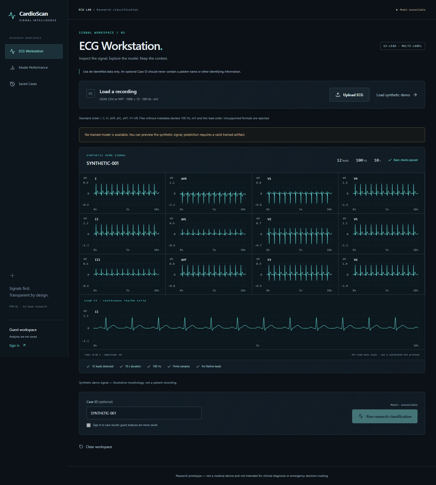
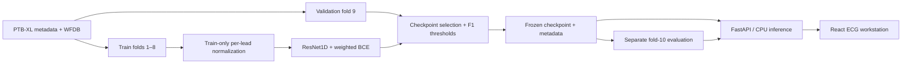

# CardioScan · ECG Signal Intelligence

An end-to-end, AI-assisted 12-lead ECG classification research prototype built with PyTorch, PTB-XL, FastAPI and React.

**Status: ready for a new training run; awaiting final evaluation.** No performance from the retired experiment is used by this application. A missing or incompatible model disables prediction.



Developed by **Khaloufi Youssef** and **Bourti Ayoub**, supervised by **Pr. Ezziyyani Mostafa**.

## 1. Overview

CardioScan combines a reproducible multilabel ECG experiment with a transparent waveform workstation. Inspect twelve leads, validate an upload, view five model scores with their decision thresholds, and review the active model's provenance.

**Research prototype — not a medical device and not intended for clinical diagnosis or emergency decision-making.**

## 2. Demo

Open `http://localhost:5173`, choose **Open ECG Workstation**, then **Load synthetic demo**. This generates an explicitly labeled illustrative signal; it is not a patient recording or a clinically validated simulator. Preview works without a model. Classification requires a trained artifact. Synthetic smoke-test artifacts are deliberately rejected by serving.

The waveform uses seconds and physical millivolts with labeled, per-lead automatic amplitude scaling. It does not claim calibrated paper speed or gain. See [PORTFOLIO.md](PORTFOLIO.md) for the recording checklist.

## 3. Why this project exists

A convincing ML application needs more than a prediction endpoint. This project makes data separation, normalization provenance, checkpoint selection, threshold selection, artifact compatibility and unavailable-model behavior inspectable. Its purpose is research and engineering demonstration, not clinical decision support.

## 4. Architecture


```mermaid
flowchart LR
  D[PTB-XL metadata + WFDB] --> T[Train folds 1–8]
  D --> V[Validation fold 9]
  T --> N[Train-only per-lead normalization]
  N --> M[ResNet1D + weighted BCE]
  V --> S[Checkpoint selection + F1 thresholds]
  M --> S
  S --> A[Frozen checkpoint + metadata]
  A --> E[Separate fold-10 evaluation]
  A --> API[FastAPI / CPU inference]
  E --> API
  API --> UI[React ECG workstation]
```

## 5. PTB-XL dataset

The project is developed for PTB-XL, approximately 21.8k clinical ECG recordings in the original release. Use **version 1.0.3**, which incorporates duplicate corrections. Counts are computed from your metadata, after removing records with no mapped diagnostic superclass; no full-dataset count is described as a training count.

Obtain the dataset from [PhysioNet](https://physionet.org/content/ptb-xl/1.0.3/). Training needs only `ptbxl_database.csv`, `scp_statements.csv`, and the `records100/` tree with its `.hea`/`.dat` pairs. Extract them into:

```text
data/ptb-xl/1.0.3/
  ptbxl_database.csv
  scp_statements.csv
  records100/00000/00001_lr.hea
  records100/00000/00001_lr.dat
  ...
```

Neither the dataset nor trained weights are bundled. Raw WFDB upload through the browser is not currently supported; export its physical samples to JSON/CSV/NPY first. WFDB loading for training is supported.

The official v1.0.3 metadata audit on this revision found 17,084 included training records, 2,146 validation records and 2,158 test records; 411 records had no mapped diagnostic superclass. This is a metadata audit, not a training or performance result. Reproduce it and check downloaded files with `python -m training.audit --data-dir data/ptb-xl/1.0.3 --check-files`. Only the two metadata CSVs were downloaded during repository preparation; the `records100` waveforms still need to be obtained before full training.

## 6. Prediction targets

The fixed class order is asserted in metadata, checkpoints and serving:

| Code | Diagnostic superclass |
|---|---|
| CD | Conduction disturbance |
| HYP | Hypertrophy |
| MI | Myocardial infarction |
| NORM | Normal ECG pattern |
| STTC | ST/T change |

These are dataset annotation targets, not diagnoses produced by the application. Diagnostic SCP code presence determines labels via `scp_statements.csv`; likelihood zero means unknown likelihood and does not erase a recorded code. Unmapped records are excluded with IDs recorded in the run audit.

## 7. Methodology

- Verify record/path uniqueness, valid folds, patient separation and disjoint IDs before training. Hash development waveforms to reject exact duplicates; final evaluation checks test waveforms against those hashes.
- Learn one mean and standard deviation per lead from **training folds only**. Apply the stored values through the same `training.preprocessing.preprocess` function in training and serving. No filtering or per-record normalization is applied.
- Default loss is `BCEWithLogitsLoss`, with `pos_weight = negatives / positives` calculated from the training labels only. There is no weighted sampler or focal-loss stack.
- Select the best checkpoint by **validation macro AUROC**; ReduceLROnPlateau and early stopping also use that quantity.
- Reload the frozen best checkpoint, predict fold 9, and maximize each class's validation F1 over observed score thresholds. Ties select the highest threshold. Save the exact values.
- No calibration is fitted. A single fold already serves model selection and threshold selection, so a further calibration fit would need careful assessment. Outputs are **uncalibrated model scores**, not clinically calibrated disease probabilities. Fold-9 threshold metrics are not unbiased generalization estimates.

Training retains all labeled records with valid shape, units and finite samples, including dataset quality variation. Serving adds a conservative rejection gate for near-flat leads (standard deviation below `1e-5 mV`) and values outside ±100 mV. This gate is a basic engineering check, not a clinically validated quality score; it does not alter accepted waveforms. Final benchmark metrics cover the full included test partition, not only the serving quality gate's accepted subset.

## 8. Official train / validation / test split

| Partition | `strat_fold` | Permitted use |
|---|---|---|
| Train | 1–8 | Weights, normalization statistics, class weights |
| Validation | 9 | Checkpoint selection, scheduler, early stopping, thresholds |
| Final test | 10 | One evaluation after all decisions are frozen |

This follows the [official patient-separated protocol](https://physionet.org/content/ptb-xl/1.0.3/). Training reads test metadata for separation audits but **never loads test waveforms or uses test outcomes for fitting or tuning**. After final evaluation, do not change architecture, preprocessing, hyperparameters or thresholds in response to test results and then claim a fresh untouched evaluation.

## 9. Model architecture

`training/model.py` is the single model implementation: a 15-sample stem convolution with stride 2, max pooling, four residual stages (64 → 128 → 256 → 512), two blocks per stage, kernel-7 convolutions, progressive stride-2 downsampling, BatchNorm and ReLU. Projection shortcuts handle width/stride changes. Adaptive pooling, dropout and a five-logit linear head complete the model.

The default theoretical receptive field before global pooling spans 1,291 input samples (the input has 1,000); the retired six-convolution stride-1 model spanned only 13. This is an architectural change, not a claim of improved measured performance. Configuration is serialized with each checkpoint. CPU inference defaults to four PyTorch threads.

## 10. Training

Run every Python command from the repository root. Python **3.12** is the tested version. First install dependencies as described in Local setup and obtain the dataset above.

```powershell
python -m training.train --data-dir data/ptb-xl/1.0.3 --run-dir artifacts/ptbxl-resnet1d-v1 --dataset-version 1.0.3 --seed 42 --epochs 60 --batch-size 64 --learning-rate 0.001 --weight-decay 0.0001 --dropout 0.3 --workers 0 --scheduler plateau --patience 10 --device auto
```

CUDA is used automatically if the installed PyTorch build and hardware support it; AMP is enabled only on CUDA. `--no-amp` disables it. For a CUDA wheel, follow the [official PyTorch installer](https://pytorch.org/get-started/locally/) for your hardware, preserving the pinned PyTorch version. The default environment may have a CPU-only wheel; `--device cuda` fails clearly if unavailable.

Run `python -m training.train --help` for all options. CPU training is supported but a full run may be slow. `--threads` controls CPU parallelism. Windows defaults to `--workers 0` to avoid process-spawn overhead; increase after checking available RAM. Approximately 1 GB of waveform arrays is retained during training, plus model/optimizer memory and worker overhead.

An interrupted run can resume with the **same command plus `--resume`**. The optimizer, scheduler, scaler, history and RNG states are restored from `last_checkpoint.pt`; the configuration and data fingerprints must match. `--epochs` can be increased while resuming an unfinished run. Once `model_metadata.json` exists, the run is frozen and cannot resume or be overwritten. Use a new run directory for a new experiment, and update `MODEL_DIR` explicitly.

## 11. Evaluation

Only after all choices are final:

```powershell
python -m training.evaluate --data-dir data/ptb-xl/1.0.3 --run-dir artifacts/ptbxl-resnet1d-v1 --device cpu --batch-size 64 --bootstrap 1000
```

This command performs no fitting. It uses the frozen checkpoint, stored training normalization and validation thresholds. An evaluation-start marker records test access. Existing results cannot be overwritten. If evaluation fails, inspect the cause; `--retry-failed` permits completion of that same frozen evaluation after a technical failure. Do not use it for tuning.

Reports include macro/micro/per-class AUROC and AUPRC (average precision), macro/micro F1, per-class precision, sensitivity, specificity, F1, support and thresholds. Undefined metrics serialize as `null`. Optional 95% AUROC intervals resample **patients**, preserving correlated repeated recordings; the intervals condition on the trained model, not training variability. `--bootstrap 0` skips intervals.

## 12. Results

**Awaiting final evaluation.** No real PTB-XL training or held-out evaluation is included in this revision. Synthetic fixture metrics validate the software only and are never presented as model performance.

The generated run directory is the deployable model bundle:

```text
artifacts/ptbxl-resnet1d-v1/
  best_model.pt                 # inference weights + architecture identity
  last_checkpoint.pt            # interrupted-training recovery
  model_metadata.json           # canonical serving contract; finalization marker
  thresholds.json               # human-readable export of metadata thresholds
  training_config.json
  training_history.json
  split_audit.json
  development_waveform_hashes.json
  validation_predictions.npz
  evaluation_started.json       # created only by evaluation
  test_predictions.npz          # created only by evaluation
  metrics.json                  # created only by evaluation
  curves.json                   # bounded plotting points, only after evaluation
  plots/
    learning_curves.png
    class_distribution.png      # train + validation positive counts
    roc_curves.png
    precision_recall_curves.png
    confusion_matrices.png
```

Weights are SHA-256 bound to metadata, with strict architecture and class-order checks. Evaluation metrics/curves are also hash-bound. Hashes detect accidental mismatches, not malicious artifact forgery: load artifacts only from a trusted source. `torch.load(weights_only=True)` is used. Never copy old thresholds or metrics into a new run. The UI reads `/api/model`; changing `MODEL_DIR` and restarting selects the whole bundle atomically from the application's perspective.

## 13. Application stack

React 18 + Vite + Tailwind CSS, canvas waveforms, FastAPI + Pydantic, PyTorch, NumPy, WFDB, pandas and scikit-learn. SQLite/aiosqlite stores accounts and explicitly saved result summaries. JWT/bcrypt preserve the original pragmatic authentication architecture.

## 14. API

Interactive schema: `http://localhost:8000/docs`.

| Endpoint | Behavior |
|---|---|
| `GET /health`, `/api/health` | HTTP 200 when model ready, 503 when unavailable |
| `GET /api/model` | Safe metadata, actual evaluated metrics if present; works without model |
| `POST /api/predict/` | JSON inference; anonymous by default, never implicitly stored |
| `POST /api/predict/validate-file` | Multipart upload → validated canonical JSON, no inference/storage |
| `POST /api/predict/file` | Multipart JSON/CSV/NPY inference |
| `POST /api/auth/register`, `/api/auth/login` | Account + token |
| `GET /api/history/`, `DELETE /api/history/{id}` | Authenticated, owner-only results |
| `GET /api/stats/` | Authenticated summary of explicitly saved results |

Canonical JSON request:

```json
{
  "signal_data": [["1000 rows, each containing 12 numeric mV values"]],
  "leads": ["I", "II", "III", "aVR", "aVL", "aVF", "V1", "V2", "V3", "V4", "V5", "V6"],
  "sample_rate": 100,
  "units": "mV",
  "case_id": "DEMO-001",
  "save_history": false
}
```

The `signal_data` line above explains the shape; generate a complete valid payload with `node scripts/export_demo.mjs`. Then:

```powershell
curl.exe -X POST http://localhost:8000/api/predict/ -H "Content-Type: application/json" --data-binary @artifacts/demo/synthetic_demo.json
```

Accepted uploads: JSON array or `signal_data` object; CSV with exact canonical lead-name header or numeric rows; numeric NPY `(1000, 12)` with pickle disabled. Maximum file size is 2 MiB. Headerless CSV/NPY/raw JSON declare the documented standard order, 100 Hz and mV; the API warns when lead metadata is absent. Named lead permutations, strings, NaN/Inf, missing/flat leads, transposed arrays, unsupported rate/duration/units and extreme amplitudes are rejected rather than silently transformed. Old JSON `signal_data` requests remain accepted when canonical; demographic fields are no longer stored.

Responses include all five ordered class scores, thresholds, positive flags, model version, basic signal quality, preprocessing provenance and warnings. NORM and abnormal superclasses may cross their thresholds simultaneously; these independent multilabel outputs are preserved and flagged explicitly.

## 15. Local setup

PowerShell, from the repository root:

```powershell
py -3.12 -m venv .venv
.venv\Scripts\python.exe -m pip install -r requirements.txt
Copy-Item .env.example .env
.venv\Scripts\python.exe -m uvicorn app.main:app --app-dir backend --env-file .env --reload --port 8000
```

If Python 3.12 is not installed, install it first. This workspace's setup used `uv venv --python 3.12 .venv`. To use the training commands verbatim without PowerShell activation-policy changes, set the current session's PATH:

```powershell
$env:Path = "$PWD\.venv\Scripts;$env:Path"
```

In a second terminal:

```powershell
cd frontend
npm.cmd ci
npm.cmd run dev
```

On Linux/macOS use `python3.12 -m venv .venv`, `source .venv/bin/activate`, and `npm` in place of `npm.cmd`. For serving only, install `backend/requirements.txt` instead of the larger root training requirements. Run the backend from the repository root so the shared `training` package is importable.

Environment variables: `MODEL_DIR` (default `artifacts/ptbxl-resnet1d-v1`), `MODEL_DEVICE=cpu|auto|cuda` (default CPU), `MODEL_THREADS=4`, `DB_PATH`, `CORS_ORIGINS`, `APP_ENV`, `SECRET_KEY`. Vite proxies `/api` to port 8000; `VITE_DEV_PROXY_TARGET` overrides the target, and `VITE_API_URL` can select an explicit API origin at build time.

Without a trained artifact, health correctly returns 503 and prediction remains unavailable. The UI, metadata endpoint, upload validation and accounts remain usable. No random-weight fallback exists.

Production mode requires a generated, non-placeholder `SECRET_KEY` of at least 32 characters. Generate one with `python -c "import secrets; print(secrets.token_urlsafe(48))"`. Development uses a random ephemeral key when none is configured, so sessions expire on restart. Anonymous predictions are never saved; authenticated predictions are saved only with `save_history=true`. Old database history is preserved in its legacy table and not mixed into the new UI. Protect and back up the database appropriately; the application makes no compliance claim. Public internet deployment also requires HTTPS, rate limiting and operational access controls; this is a local portfolio deployment baseline.

## 16. Docker

`docker compose up --build` serves a production frontend build through nginx on `http://localhost:5173`, proxying `/api` to FastAPI. Artifacts mount read-only from `./artifacts`, and SQLite uses a named volume. The default mode is local development for account-secret handling; to use production mode, set `APP_ENV=production` and a generated `SECRET_KEY` in `.env`. Missing/placeholder keys then prevent startup. No Vite development server is used in the production frontend container.

For frontend hot reload, use `docker compose -f docker-compose.yml -f docker-compose.dev.yml up --build`. No cloud infrastructure or remote deployment is performed by these commands.

## 17. Repository structure

```text
training/          canonical data, preprocessing, model, train/evaluate and artifacts
backend/app/       FastAPI routes, authentication, artifact-based inference
frontend/src/      React workstation, waveform viewer, provenance and history
tests/             synthetic ML and API regression tests
scripts/           synthetic pipeline smoke and demo export
notebooks/         EDA guidance only
archive/legacy/    retired runtime, notebook, reports and samples (not current evidence)
docs/images/       portfolio screenshots
MODEL_CARD.md      intended use, evaluation and limitations
PORTFOLIO.md       About fields and demo checklist
```

## 18. Reproducibility

Python/NumPy/PyTorch/CUDA RNGs are seeded, deterministic PyTorch algorithms are required, cuDNN benchmarking is disabled and workers receive deterministic seeds. Exact reproducibility is expected on the same software/hardware configuration, not across arbitrary devices or library releases. Metadata records the seed, architecture, normalization, best epoch, dataset fingerprint, software versions, git commit and dirty-worktree flag. Commit reviewed code before the definitive training run.

Dependencies are resolved into pinned root and backend requirements; source constraints are in `requirements-*.in`. Frontend `package-lock.json` is committed. CPU fixtures require no dataset download:

```powershell
python -m pytest -q
python -m scripts.smoke --output artifacts/smoke-check
npm.cmd --prefix frontend run lint
npm.cmd --prefix frontend run build
```

Choose a fresh directory for each smoke run. CI runs unit/API tests, frontend lint and build; never full PTB-XL training. Optional Make targets mirror these commands.

CI and Docker use `scripts/install_cpu.py`, which reads the pinned PyTorch version and installs its official CPU wheel before the remaining requirements. For optional browser checks, start the backend without a model, then run `cd frontend`, `npx playwright install chromium`, and `npx playwright test`. On Windows with Edge installed, `$env:PW_CHANNEL='msedge'` avoids a Chromium download. These tests capture `docs/images/workstation.png` and check the mobile layout. They expect a missing-model state.

## 19. Limitations

PTB-XL reflects particular historical acquisition settings and populations. Labels may be noisy or ambiguous; device/site/demographic shift can affect outputs. No prospective, external or subgroup clinical validation is claimed. Prevalence affects precision and validation-selected thresholds may not transfer. The project does not identify every rhythm disorder or replace expert waveform review. Independent NORM/abnormal outputs may conflict. A negative superclass flag cannot establish absence of disease. Basic input checks cannot detect all electrode swaps, artifact or unit mislabeling.

## 20. Medical / research disclaimer

Research prototype — not a medical device and not intended for clinical diagnosis or emergency decision-making. Performance on PTB-XL does not establish clinical effectiveness. No FDA/CE approval, clinical-grade accuracy, cardiologist equivalence or privacy-regulation compliance is claimed.

## 21. Dataset citation / license

PTB-XL v1.0.3 is distributed under [CC BY 4.0](https://creativecommons.org/licenses/by/4.0/). Attribute the dataset creators when using recordings or derived results. Dataset data are not bundled in this repository.

- Wagner, P., Strodthoff, N., Bousseljot, R., Samek, W., & Schaeffter, T. (2022). *PTB-XL, a large publicly available electrocardiography dataset*, version 1.0.3. PhysioNet. [doi:10.13026/kfzx-aw45](https://doi.org/10.13026/kfzx-aw45).
- Wagner et al. (2020). *PTB-XL, a large publicly available electrocardiography dataset*. Scientific Data 7, 154. [doi:10.1038/s41597-020-0495-6](https://doi.org/10.1038/s41597-020-0495-6).
- Strodthoff et al. (2021). *Deep Learning for ECG Analysis: Benchmarks and Insights from PTB-XL*. IEEE JBHI 25(5), 1519–1528. [doi:10.1109/JBHI.2020.3022989](https://doi.org/10.1109/JBHI.2020.3022989).
- Goldberger et al. (2000). *PhysioBank, PhysioToolkit, and PhysioNet*. Circulation 101(23), e215–e220. [doi:10.1161/01.CIR.101.23.e215](https://doi.org/10.1161/01.CIR.101.23.e215).

The existing [LICENSE.txt](LICENSE.txt) is preserved. No additional rights over the dataset are implied.

## 22. Future work

External dataset evaluation, subgroup analysis, dedicated calibration assessment, validated signal-quality detection, explainability with appropriate caveats, and a paired WFDB upload adapter. These are future investigations, not capabilities or validations already completed.
